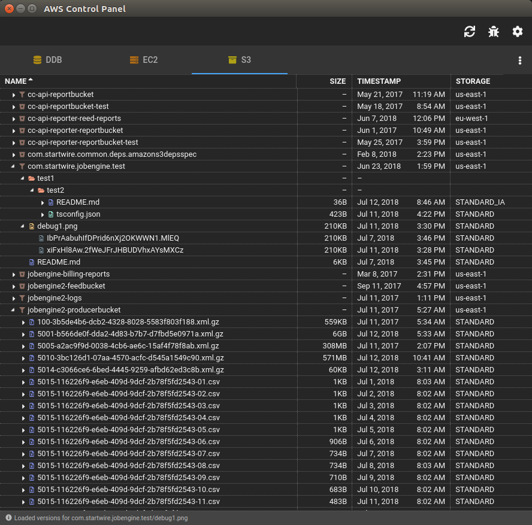

# EL-AWS - A Control Panel for AWS

There's no doubt that Amazon Web Services (AWS) is a first class cloud computing service. Professionally, we rely on it to run our business. I always like to amuse my non-technical friends by telling them that Amazon's most profitable product is one they've never heard of, yet very likely use every day.

At a programming level, the AWS APIs are also excellent. Their breadth is huge, spanning dozens of AWS offerings; their depth too, as the APIs support all modern programming languages from Ruby to TypeScript. Yet they are remarkably consistent, idiomatic and well-designed and documented.

Despite all of that, the Web-based UI that Amazon provides to support AWS is in my opinion sub-par, hence El-AWS, the latest in my small suite (see [_El terminador_](https://github.com/mflorence99/el-term) and [_Elf_](https://github.com/mflorence99/el-aws) for instance) of Electron-based apps.

> This initial release provides a UI only over S3. UIs for DynamoDB and EC2 will follow shortly.

<!-- toc -->

- [Highlights](#highlights)
- [EL-AWS in Action](#el-aws-in-action)
- [Technology Stack](#technology-stack)
- [Authentication](#authentication)
- [How to Run in Development Mode](#how-to-run-in-development-mode)
- [How to Run in Production Mode (Linux)](#how-to-run-in-production-mode-linux)
- [How to Run in Production Mode (Windows and Mac)](#how-to-run-in-production-mode-windows-and-mac)
- [S3 Notes and Tips](#s3-notes-and-tips)

<!-- tocstop -->

## Highlights 



* Tabbed interface over each supported AWS product
* S3 buckets and their contents are represented by a modern, explorer-style interface
* All actions are performed through expandable sidebars, leaving the UI simple and uncluttered
* All customizations are automatically persisted

## EL-AWS in Action


## Technology Stack

EL-AWS was essentially made possible by [ngxs](https://ngxs.io). It is an amazing state management pattern and no Angular project should be started IMHO without at least considering it. The entire state of EL-AWS is managed by `ngxs`, just as in the others in my suite of Electron apps. 

As always, in addition to `ngxs`, I have relied heavily on one of the best tech stacks currently available:

* [Electron](https://electronjs.org/) to build a cross-platform desktop app with [TypeScript](http://www.typescriptlang.org/), HTML and CSS.
* [Angular](https://angular.io/docs) as a framework for SPAs.
* Thorsten Hans' [ngx-electron](https://github.com/ThorstenHans/ngx-electron) to expose Electron's API to Angular.
* The context menu is driven by the impressive [ngx-contextmenu](https://github.com/isaacplmann/ngx-contextmenu).
* [Angular Material](https://material.angular.io/) for UI components.
* [Font Awesome](https://fontawesome.com)'s awesome library of icons.
* I've actually used [async-es](https://caolan.github.io/async/) in my other apps, but none so effectively as here. For example, EL-AWS uses async-es to aggregate S3 metadata for firing up many API calls in parallel, then joining the results when all complete.

## Authentication

EL-AWS uses AWS standard environment variables for authentication. Before starting, make sure that these are set.

```sh
AWS_ACCESS_KEY_ID=...
AWS_SECRET_ACCESS_KEY=...
```

## How to Run in Development Mode

One time only, you'll need to grab the code.

```sh
git clone https://github.com/mflorence99/el-aws.git
cd el-term
npm install
```

Next, start the dev server for the Angular client. This way, hot reload of the client is supported.

```sh
npm run serve
```

Finally, in another session, start the Electron app itself.

```sh
npm run test
```

## How to Run in Production Mode (Linux)

> NOTE: this currently only works for Ubuntu / Debian.

> I need to host the installation files.

One time only, you'll need to grab the code.

```sh
git clone https://github.com/mflorence99/el-aws.git
cd el-aws
npm install
```

Then package and install EL-AWS.

```sh
npm run package
npm run deb64
npm run deb64-install
```

## How to Run in Production Mode (Windows and Mac)

Although there are currently no installation files except for Linux, you can still start EL-AWS in production mode.

```sh
npm run live
```

## S3 Notes and Tips

Although EL-AWS presents S3 buckets and their contents just as if they were directories and files, S3's underlying architecture is different enough that this metaphor can become stretched.

One problem area lies in the APIs to retrieve a bucket's contents, which are effectively unlimited and in practice can contain many 1000's of entries. The `listObjects` family of APIs only allow up to 1000 to be retrieved at a time so currently EL-AWS has these limitations:

* Only a maximum of 500 objects can be shown in the UI from a single bucket prefix (aka directory).
* These objects are retrieved 100 at a time, using AWS continuation tokens.

To mitigate this limitation, EL-AWS provides a filter for object names and modification dates. Using this filter, it is possible to drill down into a set of desired objects.
